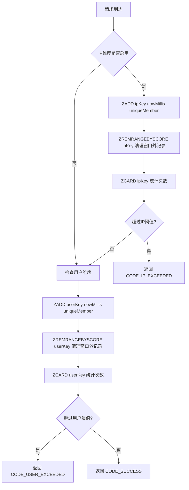

rateLimitSliding.lua 滑动窗口限流算法详解

概览
- 目标：在给定时间窗口内限制调用次数，支持“按 IP”和“按用户”两个维度的独立限流。
- 技术要点：使用 Redis `ZSET` 记录每次调用的时间戳（毫秒），按窗口滚动清理旧记录，统计当前窗口内的次数并与阈值比较。
- 实现文件：`src/main/resources/lua/rateLimitSliding.lua`，由 `SlidingRateLimitOperate` 在 Java 端加载并执行。

参数与数据结构
- 键（`KEYS`）：
  - `KEYS[1]`：按 IP 的 ZSET（可选，可能为空字符串）。
  - `KEYS[2]`：按用户的 ZSET（必选）。
- 入参（`ARGV`）：
  - `ARGV[1]`：IP 窗口毫秒数（`ipWindowMillis`）。
  - `ARGV[2]`：IP 最大尝试次数（`ipMaxAttempts`）。
  - `ARGV[3]`：用户窗口毫秒数（`userWindowMillis`）。
  - `ARGV[4]`：用户最大尝试次数（`userMaxAttempts`）。
- 数据结构：每个维度使用一个 `ZSET`，成员（member）是“毫秒时间戳 + 自增序号”的唯一字符串，分数（score）为该毫秒时间戳。

返回码
- `CODE_SUCCESS = 0`：通过限流。
- `CODE_IP_EXCEEDED = 10007`：IP 维度超过阈值。
- `CODE_USER_EXCEEDED = 10008`：用户维度超过阈值。

核心流程（逐步）
1) 获取当前毫秒时间
   - 通过 Redis `TIME` 得到 `[秒, 微秒]`，脚本转换为 `nowMillis = seconds * 1000 + floor(microseconds / 1000)`。

2) 生成唯一成员值 `uniqueMember(baseKey, nowMillis)`
   - 使用 `INCR baseKey:seq` 获取序列，确保同毫秒内多个调用不会覆盖。
   - 首次生成时对 `baseKey:seq` 设置短期过期：`PEXPIRE 600000`（10 分钟）。
   - 返回成员字符串：`"<nowMillis>:<seq>"`。

3) 检查 IP 维度（若启用）
   - 条件：`ipKey` 非空、`ipWindowMillis > 0`、`ipMaxAttempts > 0`。
   - 执行：
     - `ZADD ipKey nowMillis uniqueMember`
     - `ZREMRANGEBYSCORE ipKey 0 (nowMillis - ipWindowMillis)` 清理窗口外旧记录。
     - `ZCARD ipKey -> cnt` 获取当前窗口内调用次数。
     - 当 `cnt == 1` 时，给集合设置过期：`PEXPIRE ipKey (ipWindowMillis * 2)`（补偿空闲场景下的资源占用）。
     - 若 `cnt > ipMaxAttempts`，返回 `CODE_IP_EXCEEDED`，脚本立即终止。

4) 检查用户维度（必执行）
   - 条件：`userWindowMillis > 0`、`userMaxAttempts > 0`（Java 侧保证非零）。
   - 执行：
     - `ZADD userKey nowMillis uniqueMember`
     - `ZREMRANGEBYSCORE userKey 0 (nowMillis - userWindowMillis)`
     - `ZCARD userKey -> cnt`
     - 当 `cnt == 1` 时：`PEXPIRE userKey (userWindowMillis * 2)`。
     - 若 `cnt > userMaxAttempts`，返回 `CODE_USER_EXCEEDED`。

5) 若两维度均未超限，返回 `CODE_SUCCESS`。

设计细节与理由
- 使用 `ZSET`：按分数排序，快速删除过期段（`ZREMRANGEBYSCORE`），滑动窗口天然支持。
- 唯一成员策略：同毫秒内用 `seq` 区分，避免覆盖；无需关心成员具体值，计数只看 `ZCARD`。
- 清理策略：每次写入后都清理窗口外记录，保持集合大小与窗口内请求数量一致。
- 过期设置：为 `baseKey:seq` 与首次出现的集合设置过期，降低空闲资源占用；不影响“窗口滚动 + 计数”逻辑。
- 检查顺序：先 IP 后用户。IP 维度作为粗筛，用户维度作为细筛；一旦 IP 超限，立即返回，节省资源。

Java 侧调用关系
- `RedisRateLimitHandler#execute(...)`：
  - 根据场景（`RateLimitScene`）读取窗口与阈值配置，决定是否启用滑动窗口。
  - 构建两个维度的 Redis Key（`SECKILL_LIMIT_IP_SW_TAG_KEY`、`SECKILL_LIMIT_USER_SW_TAG_KEY`）。
  - 组装 `ARGV`：IP/用户窗口毫秒数与最大尝试次数。
  - 通过 `executeLua(true, keys, args)` 调用 `SlidingRateLimitOperate`。
- `SlidingRateLimitOperate`：
  - 在 `@PostConstruct` 中加载 `lua/rateLimitSliding.lua`。
  - 通过 `RedisCache` 执行脚本并返回整数结果。
- 结果处理：
  - `BaseCode.SUCCESS` 放行；`BaseCode.SECKILL_RATE_LIMIT_IP_EXCEEDED` 或 `BaseCode.SECKILL_RATE_LIMIT_USER_EXCEEDED` 走拦截与惩罚策略。

示例（直观理解）
- 配置：`userWindowMillis = 1000`，`userMaxAttempts = 3`。
- 在 1 秒内依次发生 4 次调用：
  - 第 1 次：`ZCARD = 1`，通过。
  - 第 2 次：`ZCARD = 2`，通过。
  - 第 3 次：`ZCARD = 3`，通过。
  - 第 4 次：清理仍落在 1 秒窗口中，`ZCARD = 4`，超过阈值，返回 `CODE_USER_EXCEEDED`。
  - 当时间推进超过 1 秒，窗口外的早期记录被移除，计数回落。

流程图（Mermaid）

复杂度与性能
- 时间复杂度（单次调用）：
  - `ZADD` 与 `ZCARD` 为 `O(log N)` 与 `O(1)`；
  - `ZREMRANGEBYSCORE` 为 `O(log N + K)`（`K` 为被删除的成员数，通常窗口外成员很快被清理，`K` 不大）。
- 空间复杂度：窗口内最多存储“阈值”级别的成员数，随时间滚动自动回落。

常见问题（FAQ）
- Q：为什么要设置 `seq` 自增？
  - A：避免同毫秒内的多次 `ZADD` 覆盖同一成员，保证每次调用都被计数。
- Q：`PEXPIRE` 为什么只在 `cnt == 1` 时设置？
  - A：集合首次出现时设置过期即可，后续有持续请求会不断刷新窗口并保留活跃数据；避免空闲期间占用无意义的键。
- Q：如果只想按用户限流、忽略 IP 怎么做？
  - A：在 Java 侧构建 `keys` 时将 `ipKey` 置空，或将 `ipWindowMillis/ipMaxAttempts` 设为 0，即可跳过 IP 维度。