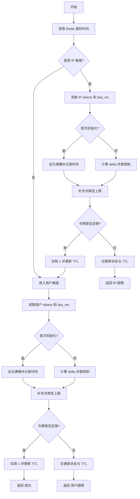

# tokenBucket.lua 脚本详解与流程图

本文面向“看代码不直观”的场景，对 `hmdp-redis-rate-limit-framework/src/main/resources/lua/tokenBucket.lua` 的实现进行逐行解释，并给出流程图、参数映射、示例推演与调优建议。阅读完毕后，开发与运维可据此自信地调参与排错。

## 1. 作用与定位
- 令牌桶限流，控制“平均速率 + 突发容量”。
- 支持两个维度：IP 与用户（IP 可选、用户必选）。
- 单次判断 O(1)，写放大小，吞吐高，适合秒杀等高并发入口的节奏控制。

## 2. 参数与键约定
### KEYS（Redis 键）
- `KEYS[1]`：IP 维度桶（可选），`HASH` 结构，字段：`tokens`、`last_ms`
- `KEYS[2]`：用户维度桶（必选），`HASH` 结构，字段：`tokens`、`last_ms`

键名在 Java 侧由枚举生成（Cluster 友好，带 HashTag）：
- IP：`seckill:limit:ip:tb:{voucherId}:{ip}`（`RedisKeyManage.SECKILL_LIMIT_IP_TB_TAG_KEY`）
- 用户：`seckill:limit:user:tb:{voucherId}:{userId}`（`RedisKeyManage.SECKILL_LIMIT_USER_TB_TAG_KEY`）

### ARGV（入参）
- `ARGV[1] = ipWindowMillis`（IP窗口毫秒）
- `ARGV[2] = ipMaxAttempts`（IP窗口最大次数）
- `ARGV[3] = userWindowMillis`（用户窗口毫秒）
- `ARGV[4] = userMaxAttempts`（用户窗口最大次数）

说明：脚本将 `windowMillis` 与 `maxAttempts` 映射为令牌桶的“平均速率与容量”，无需新增配置项即可平滑迁移。

## 3. 返回码（与 Java 一致）
- `0`：成功（允许）
- `10007`：IP 维度限流（超过）
- `10008`：用户维度限流（超过）

## 4. 核心流程（逐步讲解）
脚本核心代码结构如下，关键逻辑用自然语言解释：

```lua
local now = redis.call('TIME')
local nowMillis = now[1] * 1000 + math.floor(now[2] / 1000)

local function clampDelta(delta, window)
  if delta < 0 then return 0 end
  local maxDelta = window > 0 and (window * 2) or 0
  if maxDelta > 0 and delta > maxDelta then return maxDelta end
  return delta
end

local function tryConsume(bucketKey, windowMillis, maxAttempts)
  if bucketKey == nil or bucketKey == '' or windowMillis <= 0 or maxAttempts <= 0 then
    return true
  end
  local capacity = maxAttempts
  local ratePerMs = maxAttempts / windowMillis

  local lastMs = tonumber(redis.call('HGET', bucketKey, 'last_ms'))
  local tokens = tonumber(redis.call('HGET', bucketKey, 'tokens'))
  if not lastMs then
    lastMs = nowMillis
    tokens = capacity
  end

  local delta = clampDelta(nowMillis - lastMs, windowMillis)
  local refill = delta * ratePerMs
  tokens = math.min(capacity, tokens + refill)

  if tokens >= 1.0 then
    tokens = tokens - 1.0
    redis.call('HSET', bucketKey, 'tokens', tokens)
    redis.call('HSET', bucketKey, 'last_ms', nowMillis)
    local ttl = (windowMillis * 2) + math.random(0, math.max(1, math.floor(windowMillis / 10)))
    redis.call('PEXPIRE', bucketKey, ttl)
    return true
  else
    redis.call('HSET', bucketKey, 'tokens', tokens)
    redis.call('HSET', bucketKey, 'last_ms', nowMillis)
    local ttl = (windowMillis * 2) + math.random(0, math.max(1, math.floor(windowMillis / 10)))
    redis.call('PEXPIRE', bucketKey, ttl)
    return false
  end
end

-- 先 IP，后用户
local ipAllowed = tryConsume(ipKey, ipWindowMillis, ipMaxAttempts)
if not ipAllowed then return CODE_IP_EXCEEDED end
local userAllowed = tryConsume(userKey, userWindowMillis, userMaxAttempts)
if not userAllowed then return CODE_USER_EXCEEDED end
return CODE_SUCCESS
```

### 4.1 当前时间与 Δt 钳制
- 取 Redis 服务器时间（毫秒）作为“令牌补充的参考时钟”，避免应用与 Redis 时钟不一致。
- `clampDelta(now - last_ms, window)`：
  - 负值 → 0（时钟回退时不补充）
  - 过大 → 钳为 `window*2`（长时间未访问导致一次性补太多令牌的保护）

### 4.2 速率与容量映射（关键）
- `capacity = maxAttempts`（桶上限，决定突发峰值）
- `ratePerMs = maxAttempts / windowMillis`（单位毫秒的生成速率）
  - 例：`window=1000ms`、`maxAttempts=2000` → `ratePerMs=2.0`（每毫秒生成 2 个令牌）

### 4.3 首次初始化（满桶）
- 若未初始化（`HGET` 返回空）：将 `last_ms` 设为当前时间、`tokens` 设为 `capacity` → 冷启动即可支撑一波合理突发。

### 4.4 补充与消费
- 补充：`tokens = min(capacity, tokens + delta * ratePerMs)`
- 判断：若 `tokens >= 1.0` → 扣减 1，更新 `tokens / last_ms` 并设置 TTL，返回允许；否则返回拒绝。

### 4.5 TTL 与抖动
- 每次更新设置过期：`ttl = window*2 + jitter(window/10)`，降低集中过期导致的短时尖峰与热键竞争。
- `HASH` 键在空闲时自动回收，避免长期占用内存。

### 4.6 判定顺序
- 先判 IP，再判用户。IP 作为粗粒度节流；用户作为细粒度控制。
- 任一维度拒绝，脚本立即返回对应错误码。

## 5. 流程图（Mermaid）


## 6. 示例推演（直觉）
场景：用户维度限流 `window=1000ms`、`maxAttempts=2000`。
- 冷启动：`tokens=2000`；前 2000 次调用（在很短时间内）都会“扣 1 并通过”。
- 若持续以 `2000 req/s` 调用：每毫秒补充 2 个令牌，平均每毫秒可通过 2 个请求；突发超出后会快速回到平衡。
- 如果 500ms 空窗后再来流量：因 `delta≈500`，会补充约 `1000` 个令牌（不超过 `capacity`），支撑短时突发。

## 7. 与滑动窗口/固定窗口的区别
- 固定窗口：一个窗口内计数，不保证边界公平；简单高效但容易窗口边界有碰撞。
- 滑动窗口（日志/计数）：严格“最近T内 ≤N”，公平性更好但写放大较高。
- 令牌桶：控制平均速率与突发，单次 O(1)，更适合高并发入口的节奏控制；不保证严格“最近T内总量 ≤N”。

## 8. 集成位置与参数映射（代码对照）
- `RedisRateLimitHandler#execute(...)`：读取 `rate-limit.*` 与端点覆盖；当 `enableSlidingWindow=true` 时走令牌桶分支。
- 键构造：
  - IP：`SECKILL_LIMIT_IP_TB_TAG_KEY` → `seckill:limit:ip:tb:{voucherId}:{ip}`
  - 用户：`SECKILL_LIMIT_USER_TB_TAG_KEY` → `seckill:limit:user:tb:{voucherId}:{userId}`
- 执行器：`TokenBucketRateLimitOperate` 加载 `lua/tokenBucket.lua`。
- 参数映射：
  - `capacity = maxAttempts`
  - `rate_per_ms = maxAttempts / windowMillis`
- 返回码：与 `BaseCode` 一致，惩罚策略（封禁）与监听器无需改动。

## 9. 调参建议（快速参考）
- 下单入口（高压）：`userMaxAttempts ≈ 目标 req/s`；`capacity ≈ 2×~5× rate`；`ipMaxAttempts` 作为粗粒度（如 `100~300 req/s`）。
- 发令牌入口（较松）：`userMaxAttempts 1000~2000 req/s`，容量 `2×~3× rate`。
- 灰度：按券或入口维度开启 `enable-sliding-window=true`（代表令牌桶），观察 Redis RTT、拒绝率、下游 p95/99、错误率后放量。

## 10. 常见问题与注意事项
- 为什么不是严格 N/T？令牌桶关注“速率与突发”，并不统计“最近T窗口内累积次数”。若必须严格窗口上限，可在令牌桶外叠加滚动计数作为保护。
- 浮点数误差：`tokens` 为小数（Double），极端情况下可能出现微小误差；不影响整体效果。
- TTL 抖动：通过 `window/10` 级抖动，降低集中过期冲击；可按集群规模适当调整抖动幅度。
- IP 可选：无法识别 IP 或不需要 IP 维度时，传空键/无效窗口即可跳过。

---
### 附：脚本文件路径
- `hmdp-redis-tool-framework/hmdp-redis-rate-limit-framework/src/main/resources/lua/tokenBucket.lua`
### 相关类
- `org.javaup.lua.TokenBucketRateLimitOperate`
- `org.javaup.execute.RedisRateLimitHandler`
- `org.javaup.config.RateLimitAutoConfiguration`
- `org.javaup.core.RedisKeyManage`（新增 TB 键枚举）